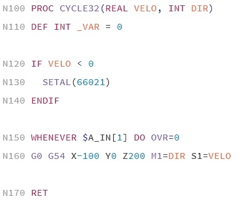

# CNC Sinumerik 840D language support

[](https://github.com/deathaxe/sublime-s840d/releases)
[](http://opensource.org/licenses/MIT)
[](https://packagecontrol.io/packages/CNC%20SINUMERIK%20840D%20language%20support)

This package provides syntax highlighting support for the SINUMERIK 840D
Computerized Numerical Control to the [SublimeText 3 Editor][1].


#### G-Code example




## 🚀 Features

#### NC cycles

  * file extensions: MPF, SPF, DEF, TEA
  * syntax highlighting
    - ISO G-Code
    - SINUMERIK highlevel commands
    - known NC cycles, functions and commands
    - known NC variables and machine data (NC-Version 04.07.02.01)
    - Highlight illegal usage of control keywords.
  * indention rules
  * code-snippets for most common control functions
  * commands to `Minify`, `Beautify`, `Add/Update block numbers`, `Save Protected Program File (CPF)`
  * Goto Definition
    - Show labels in local symbol list
    - Show PROC names in indexed symbol list
  * Context sensitive auto completions for:
    - variable attributes in definitions (access rights, unit)
    - ISO parameters (e.g.: SPOS= , FP=, ...)
    - ISO commands (e.g.: TRANS, ROT, ...)
    - functions (e.g.: COUPDEF(...))
  * tooltip support
    - *.mdat *.svar files from CreateMyConfig

### EasyScreen / RunMyScreens

  * file extensions: COM
  * syntax highlighting
  * indention rules
  * code-snippets for
    - classes: `ARRAY`, `BLOCK`, `DIALOG`, `MENU`
    - methods: `LOAD`, `UNLOAD`, `PRESS`, ...
    - functions: `RNP`, `WNP`, `CP`, `DP`, `EP`, ...
  * Goto Definition for classes.


#### NC archives (text)

  * file extensions: ARC
  * embedds NC cycles and RunMyScreens syntax highlighting


## 💾 Installation

### Package Control

For all Sublime Text 3 users install via [Package Control][2] is recommended.

  1. [Install][3] Package Control if you haven't yet.
  2. Use <kbd>ctrl+shift+P</kbd> then `Package Control: Install Package`
  3. Look for `CNC SINUMERIK 840D language support` and install it.


### Manual Installation

Clone the repository in your Sublime Text Packages directory, located somewhere
in user's "Home" directory:

```shell
git clone git://github.com/deathaxe/sublime-s840d.git "CNC Sinumerik 840D language support"
```

You can also download the latest source from GitHub
[https://github.com/deathaxe/sublime-s840d][zip] and extract the whole content
into the _"Packages/CNC Sinumerik 840D language support"_ directory.


## ⚙ Settings

All settings are organized per view and can therefore be placed to any valid
Sublime Text settings file or may be applied temporarily for single views.


#### Basic Setup

If `s840d_arc.sublime-settings`, `s840d_gcode.sublime-settings` or
`s840d_hmi.sublime-settings` don't exist in the user folder they will be
automatically created to ensure the following essential syntax specific
settings:

```JavaScript
  "ensure_newline_at_eof_on_save": true,
  "translate_tabs_to_spaces": true,
  "use_tab_stops": false
```

They are all required to ensure NC will read the resulting file correctly. You
can override these settings by creating your own syntax specific setting
`Preferences -> Settings - Syntax Specific`


#### G-Code block start

`"s840d_gcode_block_start": 0`

If not explicitly called with `"start": 0815` the `s840d_renumber` command will
use this setting as first block number. With default value `0` the first block
number is automatically selected to so all block numbers have same length.


#### G-Code block increment

`"s840d_gcode_block_increment": 10`

If not explicitly called with `"increment": 0815` the `s840d_renumber` command
will use this setting to increment the block numbers.


## © License
The code is available at [GitHub][home] under [MIT licence][lic].


[home]: <https://github.com/deathaxe/sublime-s840d>
[zip]:  <https://github.com/deathaxe/sublime-s840d/archive/master.zip>
[lic]:  <https://github.com/deathaxe/sublime-s840d/blob/master/LICENSE>
[1]:    <http://www.sublimetext.com>
[2]:    <https://packagecontrol.io>
[3]:    <https://packagecontrol.io/installation>